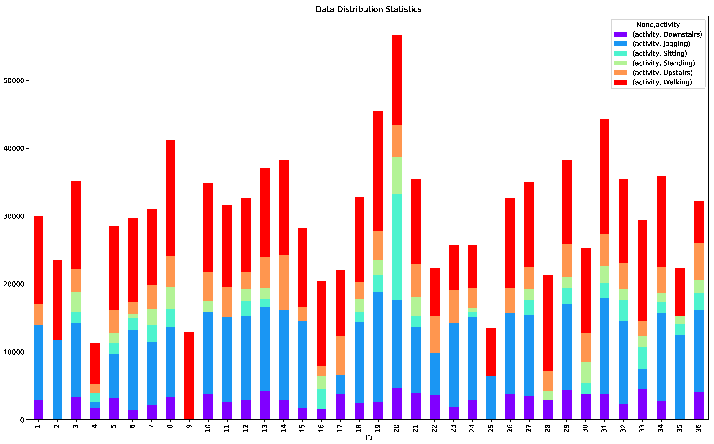

# Activity-Recognition

## 项目内容

- 模型训练及实验分析

- 手机行为识别APP开发

## 所需工具

实验实例全部运行于Python 3.6环境，尚需引入以下扩展包。

- sklearn

- pandas

- numpy

- matplotlib

- seaborn

- plotly

手机APP开发需如下支持。

- JDK 9

## 实验数据

来自[WISDM](./data_set) 数据集，志愿者数为36 人，共1098207 个采样点，包含以下六种行为。

- 静坐(Sitting)

- 站立(Standing)

- 上楼(Upstairs)

- 下楼(Downstairs)

- 步行(Walking)

- 慢跑(Jogging)

各志愿者采样数据分布直方图如下所示。

## HARPY库

HARPY(Human Activity Recognition Python Library)库是为了基于加速度数据的人体行为识别方法开发的python库，其包裹了sklearn、numpy、matplotlib的部分功能，主要目的是为行为识别研究提供便捷。

目前HARPY共包含utils(工具包)、prepocess(数据预处理)、selection(特征、数据选择)、calculate(特征值计算)、train(模型训练)、parameter(参数调优)、visualization(数据可视化)等七个模块。更多扩展功能仍在开发中，源码可在activity_recognition目录获得，本目录下startup.py文件可用于各功能测试，测试文件见data_set和feature目录。

### activity_recognition.calculate:特征值计算

> 一级接口

| 接口        |  功能      |  输入参数   |    输出(文件、返回值、打印信息)   |
|:----------: |:---------:| :---------:| :--------:|
| calculate_range_id | 计算指定范围内用户特征 | (start_id, end_id) | "$(start_id)-$(end_id).csv"写入"./feature"目录下 |
| calculate_except_range_id    | 计算不在指定范围内用户特征     | (start_id, end_id) | "except_$(start_id)-$(end_id).csv"写入"./feature"目录下 |
| calculate_id | 计算指定用户的特征  | (id) | "$(id).csv"写入"./feature"目录下 |
| calculate_per_id | 计算每个用户的特征 | - | 为每个用户在"./feature"目录下生成".csv"文件 |
| calculate_expect_id| 计算除指定用户外其他用户特征 | id | 在"./feature"目录下生成"expect_$(id).csv"文件 |
|calculate_per_expect_id | 对每个用户执行calculate_expect_id操作 | - | 对每个用户在"./feature"下生成"expect_$(id).csv"文件 |
|calculate_all| 计算所有用户特征 | - | 所有用户特征都将写入"all.scv"并写入"./feature"目录 |

### activity_recognition.train:模型训练与评估

> 一级接口

| 接口        |  功能      |  输入参数   |   输出(文件、返回值、打印信息)   |
|:----------: |:---------:| :---------:| :--------:|
| train_test_split_result | 以sklearn默认方式划分训练、测试集并训练模型 | (clf, X, y) | 打印模型性能参数 |
| stratifiedk_fold_result | 按默认参数等比例采样后训练模型 | (clf, X, y) | 打印模型性能参数 |
| k_fold_result | 以默认参数做K折交叉实验 | (clf, X, y) | 打印模型性能参数 |

### activity_recognition.parameter:参数调优

> 一级接口

| 接口        |  功能      |  输入参数   |   输出(文件、返回值、打印信息)   |
|:----------: |:---------:| :---------:| :--------:|
| grid_search_parameter | 以网格搜索方式遍历超参空间并比较模型优劣 | (clf, X, y) | 打印各参数评分及模型的最优参数组合 |
| random_search_parameter | 以随机搜索方式遍历超参空间并比较模型优劣 | (clf, X, y) | 打印各参数评分及模型的最优参数组合 |

### activity_recognition.visualization:数据可视化

> 一级接口

| 接口        |  功能      |  输入参数   |   输出(文件、返回值、打印信息)   |
|:----------: |:---------:| :---------:| :--------:|
| plot_learning_curve_default | 画出ShuffleSplit下学习曲线 | (X, y, clf) | 得到学习曲线图 |
| plot_learning_curve_cv | 画出指定交叉验证下学习曲线 |(X, y, clf, cv) | 得到学习曲线图 |
| plot_paramter_curve_default | 画出ShuffleSplit下单变量评分变化曲线 | (X, y, clf, param_name, param_range) | 得到单变量评分变化曲线 |
| plot_paramter_curve_cv | 画出指定交叉验证下单变量评分变化曲线 | (X, y, clf, cv, param_name, param_range) |得到单变量评分变化曲线 |
| plot_confusion_matrix | 按比重画出渐变色混淆矩阵 |(confusion_matrix) | 得到渐变色混淆矩阵 |
| plot_gridsearch | 画出二维网格准确率渐变色图 |(clf, X, y) | 得到二维网格准确率渐变色图 |

### activity_recognition.utils:辅助工具

> 一级接口

| 接口        |  功能      |  输入参数   |   输出(文件、返回值、打印信息)   |
|:----------: |:---------:| :---------:| :--------:|
| read_file | 读取"./feature"下特征文件 | (file_name) | 返回特征X和标签y |
| read_feature | 读取"./feature"下特征文件 | (file_name) | 只返回特征X |
| get_default_clf | 根据输入模型缩写生成默认模型 | (clf_name) | 返回模型 |
| extract_activity | 按各行为分离指定编号人员的特征文件 | (file_name, id) | 在"./feature/$(id)/"目录下生成各行为".csv"文件 |
| extract_per_people | 按各行为分离所有人员的特征文件 | - | 在所有"./feature/$(id)/"目录下生成各行为".csv"文件 |
| extract_feature | 读取各文件并截取指定特征列 | (file_name, write_file, list) | 截取的特征列写入"./feature/$(id)/$(write_file).csv"文件中 |
| extract_activuty_feature| 截取id_list中所有用户的feature_list列特征 |(id_list, feature_list)| 每个截取的特征列写入"./feature/$(id)/$(write_file).csv"文件中 |
| hash_name| 完成特证名与列号的映射 |  - | 返回映射结果（列） |

### activity_recognition.selection:参数调优

> 一级接口

| 接口        |  功能      |  输入参数   |   输出(文件、返回值、打印信息)   |
|:----------: |:---------:| :---------:| :--------:|
| activity_pearson | 计算不同用户相同行为下各对应特征列间的的皮尔森系数 |(X, Y) | 打印各特征皮尔森系数及平均皮尔森系数 |

各模块功能仍在完善中，已有功能会对输入参数做一次统一。preprocess模块需要重写。二级接口文档最近会整理。

--- 

本项目于2017.12.8日开始更新 ... 

本人Python及Java均为十月起初学，如有好的实现请邮件我！

linw7@mail2.sysu.edu.cn